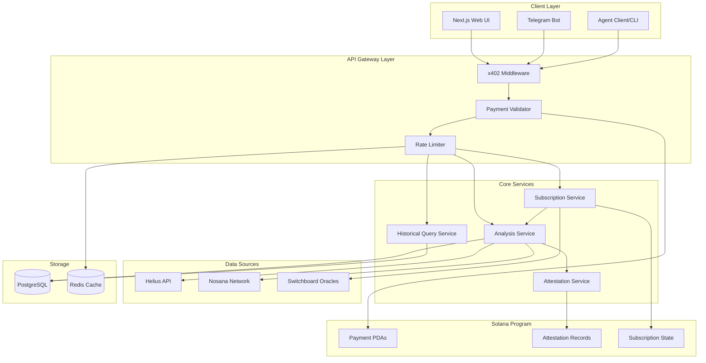

# Design Document

## Overview

The x402 integration transforms the Solana Sentinel from a standalone web application into a composable, autonomous agent ecosystem. The design introduces three major architectural layers:

1. **x402 Payment & Access Control Layer**: Wraps existing API endpoints with x402 protocol support for payment validation, receipt generation, and transparent logging
2. **Agent Communication Layer**: Enables agent-to-agent messaging, subscription management, and webhook-based alerting
3. **Oracle Integration Layer**: Integrates Switchboard feeds for real-time monitoring and automated re-analysis triggers

The system maintains backward compatibility with the existing Next.js frontend while exposing new agent-friendly endpoints. All components are designed for deployment to Solana devnet with a clear upgrade path to mainnet.

## Architecture

### High-Level System Diagram



### Component Interaction Flow

**Standard Analysis Request Flow:**
1. Client sends request with x402 headers (payment proof or request for payment)
2. x402 Middleware validates payment signature and amount
3. If valid, request proceeds to Analysis Service
4. Analysis Service orchestrates Helius + Nosana data fetching
5. AI generates risk summary via Genkit
6. Attestation Service signs the report
7. Response includes x402 receipt headers and signed attestation
8. Transaction logged to Solana program and PostgreSQL

**Subscription & Alert Flow:**
1. Agent registers subscription via x402 API with prepaid balance
2. Subscription Service creates PDA and stores webhook URL
3. Switchboard oracle feed monitored via WebSocket connection
4. When threshold exceeded, trigger re-analysis
5. Updated report sent to webhook URL
6. Subscription fee deducted from prepaid balance
7. If balance low, pause subscription and notify agent

## Components and Interfaces

### 1. x402 Middleware

**Purpose**: Intercepts all API requests to validate x402 payment proofs and generate receipts

**Implementation**:
- Next.js middleware at `/src/middleware.ts`
- Uses `@solana/web3.js` for signature verification
- Integrates with Solana program for payment validation

**Interface**:
```typescript
interface X402Headers {
  'x-payment-signature': string;      // Ed25519 signature of payment transaction
  'x-payment-pubkey': string;          // Payer's public key
  'x-payment-amount': string;          // Amount in USDC (lamports)
  'x-payment-timestamp': string;       // Unix timestamp
  'x-analysis-tier': 'basic' | 'standard' | 'premium';
}

interface X402ReceiptHeaders {
  'x-receipt-signature': string;       // Sentinel's signature
  'x-receipt-tx-hash': string;         // Solana transaction hash
  'x-receipt-timestamp': string;       // Unix timestamp
  'x-receipt-amount': string;          // Amount charged
}
```

**Key Methods**:
- `validatePaymentProof(headers: X402Headers): Promise<boolean>`
- `generateReceipt(request: Request, response: Response): X402ReceiptHeaders`
- `logTransaction(payment: PaymentRecord): Promise<void>`

### 2. Analysis Service

**Purpose**: Core service orchestrating token risk analysis

**Implementation**:
- Refactored from existing `src/app/actions.ts`
- Extracted into standalone service at `src/services/analysis.service.ts`
- Maintains existing Helius + Nosana integration

**Interface**:
```typescript
interface AnalysisRequest {
  tokenAddress: string;
  tier: 'basic' | 'standard' | 'premium';
  requesterId: string;
  includeAttestation: boolean;
  includeOracleData: boolean;
}

interface AnalysisResponse {
  report: SentinelReportData;
  attestation?: SignedAttestation;
  oracleData?: SwitchboardData;
  metadata: {
    analysisId: string;
    timestamp: number;
    tier: string;
    cost: number;
  };
}
```

**Key Methods**:
- `analyzeToken(request: AnalysisRequest): Promise<AnalysisResponse>`
- `getBasicAnalysis(tokenAddress: string): Promise<BasicReport>`
- `getStandardAnalysis(tokenAddress: string): Promise<FullReport>`
- `getPremiumAnalysis(tokenAddress: string): Promise<PremiumReport>`

### 3. Attestation Service

**Purpose**: Generates cryptographically signed attestations for analysis results

**Implementation**:
- New service at `src/services/attestation.service.ts`
- Uses Ed25519 keypair stored in environment variables
- Stores attestation metadata on Solana program

**Interface**:
```typescript
interface SignedAttestation {
  reportHash: string;                  // SHA-256 hash of report JSON
  signature: string;                   // Ed25519 signature
  signerPublicKey: string;             // Sentinel's public key
  timestamp: number;                   // Unix timestamp
  sentinelScore: number;               // Score at time of signing
  onChainTxHash?: string;              // Solana transaction storing attestation
}

interface AttestationVerification {
  isValid: boolean;
  signer: string;
  timestamp: number;
  reportMatches: boolean;
}
```

**Key Methods**:
- `signReport(report: SentinelReportData): Promise<SignedAttestation>`
- `verifyAttestation(report: SentinelReportData, attestation: SignedAttestation): Promise<AttestationVerification>`
- `storeOnChain(attestation: SignedAttestation): Promise<string>`

### 4. Subscription Service

**Purpose**: Manages real-time alert subscriptions and monitoring

**Implementation**:
- New service at `src/services/subscription.service.ts`
- Integrates Switchboard WebSocket feeds
- Background worker process for monitoring

**Interface**:
```typescript
interface SubscriptionRequest {
  tokenAddress: string;
  webhookUrl: string;
  thresholds: {
    priceVolatility?: number;          // Percentage change
    liquidityChange?: number;          // Percentage change
    holderConcentration?: number;      // Percentage threshold
  };
  prepaidBalance: number;              // USDC amount
  agentPublicKey: string;
}

interface SubscriptionStatus {
  subscriptionId: string;
  tokenAddress: string;
  status: 'active' | 'paused' | 'cancelled';
  remainingBalance: number;
  alertsTriggered: number;
  lastAlert?: number;
}
```

**Key Methods**:
- `createSubscription(request: SubscriptionRequest): Promise<SubscriptionStatus>`
- `monitorToken(subscriptionId: string): void`
- `triggerAlert(subscriptionId: string, reason: string): Promise<void>`
- `deductFee(subscriptionId: string, amount: number): Promise<void>`

### 5. Switchboard Integration Service

**Purpose**: Connects to Switchboard oracle feeds for real-time market data

**Implementation**:
- New service at `src/services/switchboard.service.ts`
- Uses `@switchboard-xyz/on-demand` SDK
- Maintains WebSocket connections for subscribed tokens

**Interface**:
```typescript
interface SwitchboardData {
  price: number;
  volume24h: number;
  liquidityDepth: number;
  priceChange1h: number;
  priceChange24h: number;
  lastUpdate: number;
  feedAvailable: boolean;
}

interface SwitchboardMonitor {
  tokenAddress: string;
  symbol: string;
  callback: (data: SwitchboardData) => void;
}
```

**Key Methods**:
- `getFeedData(tokenAddress: string): Promise<SwitchboardData>`
- `subscribeFeed(monitor: SwitchboardMonitor): string`
- `unsubscribeFeed(subscriptionId: string): void`
- `checkThresholds(data: SwitchboardData, thresholds: any): boolean`

### 6. Telegram Bot Service

**Purpose**: Provides user-friendly Telegram interface for token analysis

**Implementation**:
- New service at `src/services/telegram.service.ts`
- Uses `node-telegram-bot-api` library
- Integrates with Analysis Service and Subscription Service

**Interface**:
```typescript
interface TelegramCommand {
  command: string;
  chatId: number;
  userId: number;
  args: string[];
}

interface TelegramResponse {
  text: string;
  parseMode: 'Markdown' | 'HTML';
  replyMarkup?: any;
}
```

**Key Methods**:
- `handleAnalyzeCommand(chatId: number, tokenAddress: string): Promise<void>`
- `handleSubscribeCommand(chatId: number, tokenAddress: string): Promise<void>`
- `handleBalanceCommand(chatId: number): Promise<void>`
- `sendAlert(chatId: number, report: SentinelReportData): Promise<void>`

### 7. Solana Program

**Purpose**: On-chain state management for payments, attestations, and subscriptions

**Implementation**:
- Anchor program at `programs/sentinel/src/lib.rs`
- Deployed to Solana devnet
- Three main account types: Payment, Attestation, Subscription

**Account Structures**:
```rust
#[account]
pub struct PaymentAccount {
    pub payer: Pubkey,
    pub amount: u64,
    pub timestamp: i64,
    pub analysis_id: String,
    pub tier: u8,
}

#[account]
pub struct AttestationAccount {
    pub report_hash: [u8; 32],
    pub signer: Pubkey,
    pub timestamp: i64,
    pub sentinel_score: u8,
}

#[account]
pub struct SubscriptionAccount {
    pub agent: Pubkey,
    pub token_mint: Pubkey,
    pub webhook_url: String,
    pub prepaid_balance: u64,
    pub status: u8,
    pub alerts_triggered: u32,
}
```

**Instructions**:
- `initialize_payment(amount: u64, tier: u8)`
- `store_attestation(report_hash: [u8; 32], score: u8)`
- `create_subscription(token_mint: Pubkey, webhook: String, balance: u64)`
- `deduct_subscription_fee(subscription: Pubkey, amount: u64)`

### 8. CLI Tool

**Purpose**: Command-line interface for agent registration and management

**Implementation**:
- New package at `cli/` directory
- Built with Commander.js
- Integrates with Solana program

**Commands**:
```bash
sentinel-cli register --wallet <path> --endpoint <url>
sentinel-cli analyze <token-address> --tier <basic|standard|premium>
sentinel-cli subscribe <token-address> --webhook <url> --balance <amount>
sentinel-cli balance --wallet <path>
sentinel-cli history <token-address> --days <number>
```

## Data Models

### PostgreSQL Schema

```sql
-- Analysis records
CREATE TABLE analyses (
    id UUID PRIMARY KEY DEFAULT gen_random_uuid(),
    token_address VARCHAR(44) NOT NULL,
    requester_pubkey VARCHAR(44) NOT NULL,
    tier VARCHAR(20) NOT NULL,
    sentinel_score INTEGER NOT NULL,
    report_data JSONB NOT NULL,
    attestation_signature TEXT,
    cost_usdc DECIMAL(10, 6) NOT NULL,
    created_at TIMESTAMP DEFAULT NOW(),
    INDEX idx_token_address (token_address),
    INDEX idx_created_at (created_at)
);

-- Subscriptions
CREATE TABLE subscriptions (
    id UUID PRIMARY KEY DEFAULT gen_random_uuid(),
    subscription_id VARCHAR(44) NOT NULL UNIQUE,
    agent_pubkey VARCHAR(44) NOT NULL,
    token_address VARCHAR(44) NOT NULL,
    webhook_url TEXT NOT NULL,
    thresholds JSONB NOT NULL,
    prepaid_balance DECIMAL(10, 6) NOT NULL,
    status VARCHAR(20) NOT NULL,
    alerts_triggered INTEGER DEFAULT 0,
    created_at TIMESTAMP DEFAULT NOW(),
    updated_at TIMESTAMP DEFAULT NOW(),
    INDEX idx_agent_pubkey (agent_pubkey),
    INDEX idx_status (status)
);

-- Payment transactions
CREATE TABLE payments (
    id UUID PRIMARY KEY DEFAULT gen_random_uuid(),
    tx_hash VARCHAR(88) NOT NULL UNIQUE,
    payer_pubkey VARCHAR(44) NOT NULL,
    amount_usdc DECIMAL(10, 6) NOT NULL,
    analysis_id UUID REFERENCES analyses(id),
    subscription_id UUID REFERENCES subscriptions(id),
    created_at TIMESTAMP DEFAULT NOW(),
    INDEX idx_payer_pubkey (payer_pubkey)
);

-- Alert history
CREATE TABLE alerts (
    id UUID PRIMARY KEY DEFAULT gen_random_uuid(),
    subscription_id UUID REFERENCES subscriptions(id),
    token_address VARCHAR(44) NOT NULL,
    trigger_reason TEXT NOT NULL,
    sentinel_score INTEGER NOT NULL,
    webhook_delivered BOOLEAN DEFAULT FALSE,
    created_at TIMESTAMP DEFAULT NOW()
);
```

### Redis Cache Structure

```
# Rate limiting
rate_limit:{pubkey}:count -> integer (TTL: 60s)
rate_limit:{pubkey}:window -> timestamp

# Switchboard feed cache
switchboard:{token_address}:data -> JSON (TTL: 30s)
switchboard:{token_address}:last_update -> timestamp

# Analysis cache (for basic tier)
analysis:{token_address}:basic -> JSON (TTL: 300s)
```

## Error Handling

### Error Categories

1. **Payment Errors (402)**
   - Invalid signature
   - Insufficient payment
   - Expired payment proof
   - Response: Payment request with required amount

2. **Authentication Errors (401)**
   - Missing x402 headers
   - Invalid public key
   - Response: Authentication required message

3. **Rate Limit Errors (429)**
   - Exceeded free tier limits
   - Too many requests
   - Response: Retry-After header with cooldown period

4. **Service Errors (503)**
   - Helius API unavailable
   - Nosana job timeout
   - Switchboard feed unavailable
   - Response: Partial results with degraded service notice

5. **Validation Errors (400)**
   - Invalid token address
   - Invalid webhook URL
   - Invalid threshold values
   - Response: Detailed validation error messages

### Error Response Format

```typescript
interface ErrorResponse {
  error: {
    code: string;
    message: string;
    details?: any;
    retryable: boolean;
  };
  x402?: {
    paymentRequired: boolean;
    amount: string;
    recipient: string;
    memo: string;
  };
}
```

### Retry Strategy

- Helius API: 3 retries with exponential backoff (1s, 2s, 4s)
- Nosana jobs: 15 polling attempts at 5-second intervals
- Switchboard feeds: Auto-reconnect on WebSocket disconnect
- Webhook delivery: 3 retries with exponential backoff, then mark failed

## Testing Strategy

### Unit Tests

**Coverage Target**: 80% minimum

**Key Test Suites**:
1. `x402-middleware.test.ts`
   - Payment signature validation
   - Receipt generation
   - Header parsing

2. `analysis-service.test.ts`
   - Tier-based feature gating
   - Score calculation logic
   - Mock Helius/Nosana responses

3. `attestation-service.test.ts`
   - Signature generation
   - Verification logic
   - Hash computation

4. `subscription-service.test.ts`
   - Subscription lifecycle
   - Balance management
   - Alert triggering

### Integration Tests

**Test Scenarios**:
1. End-to-end analysis flow with x402 payment
2. Subscription creation and alert delivery
3. Switchboard feed integration
4. Telegram bot command handling
5. CLI tool operations

**Test Environment**:
- Solana devnet
- Mock Helius API (using MSW)
- Mock Nosana jobs
- Test PostgreSQL database
- Test Redis instance

### Load Tests

**Performance Targets**:
- API response time: < 2s for standard analysis
- Concurrent requests: 100 req/s sustained
- Switchboard monitoring: 1000 active subscriptions
- Webhook delivery: < 5s latency

**Tools**:
- k6 for load testing
- Artillery for WebSocket stress testing

### Security Tests

**Focus Areas**:
1. Payment signature verification bypass attempts
2. SQL injection in query parameters
3. Webhook URL validation (SSRF prevention)
4. Rate limit bypass attempts
5. Replay attack prevention

## Deployment Architecture

### Development Environment

```
Local Machine:
- Next.js dev server (port 9002)
- PostgreSQL (Docker container)
- Redis (Docker container)
- Solana CLI (devnet)
- Switchboard local validator (optional)
```

### Devnet Deployment

```
Vercel:
- Next.js application
- Serverless functions for API routes
- Environment variables for keys

Solana Devnet:
- Sentinel program deployed
- Test USDC mint
- Payment/Attestation/Subscription PDAs

External Services:
- Helius devnet API
- Nosana testnet
- Switchboard devnet feeds

Database:
- Supabase PostgreSQL (free tier)
- Upstash Redis (free tier)
```

### Mainnet Upgrade Path

1. Deploy Solana program to mainnet
2. Switch to mainnet USDC mint
3. Update Helius API to mainnet endpoint
4. Configure Switchboard mainnet feeds
5. Scale database to production tier
6. Enable monitoring and alerting

## Security Considerations

### Private Key Management

- Sentinel signing key stored in environment variables
- Never exposed in client-side code
- Rotated monthly
- Backup stored in secure vault

### Payment Validation

- All signatures verified on-chain
- Timestamp validation (max 5-minute window)
- Nonce tracking to prevent replay attacks
- Amount validation against tier pricing

### Webhook Security

- URL validation (no localhost, no internal IPs)
- HTTPS required for production
- Signature included in webhook payload
- Retry limit to prevent abuse

### Rate Limiting

- Free tier: 10 requests/hour per IP
- Paid tier: 100 requests/hour per wallet
- Subscription monitoring: No limit
- CLI tool: 50 requests/hour per wallet

## Performance Optimizations

### Caching Strategy

1. **Basic Analysis Cache**: 5-minute TTL
   - Reduces load on Helius/Nosana
   - Acceptable staleness for free tier

2. **Switchboard Feed Cache**: 30-second TTL
   - Reduces WebSocket connections
   - Still provides near-real-time data

3. **Historical Query Cache**: 1-hour TTL
   - Historical data rarely changes
   - Significant cost savings

### Database Optimizations

- Indexes on frequently queried columns
- Partitioning on `created_at` for analyses table
- Connection pooling (max 20 connections)
- Read replicas for historical queries

### API Optimizations

- Parallel fetching of Helius + Nosana data
- Streaming responses for large historical queries
- Compression for API responses (gzip)
- CDN caching for static assets

## Monitoring and Observability

### Metrics

- Request rate by endpoint and tier
- Payment success/failure rate
- Analysis completion time (p50, p95, p99)
- Switchboard feed latency
- Webhook delivery success rate
- Database query performance

### Logging

- Structured JSON logs
- Log levels: DEBUG, INFO, WARN, ERROR
- Sensitive data redaction (private keys, signatures)
- Correlation IDs for request tracing

### Alerting

- Payment validation failures > 5% in 5 minutes
- Analysis service errors > 10% in 5 minutes
- Switchboard feed disconnections
- Database connection pool exhaustion
- Webhook delivery failures > 20%

### Dashboard

- Real-time request volume
- Revenue tracking (USDC collected)
- Active subscriptions count
- Top analyzed tokens
- Error rate by category
